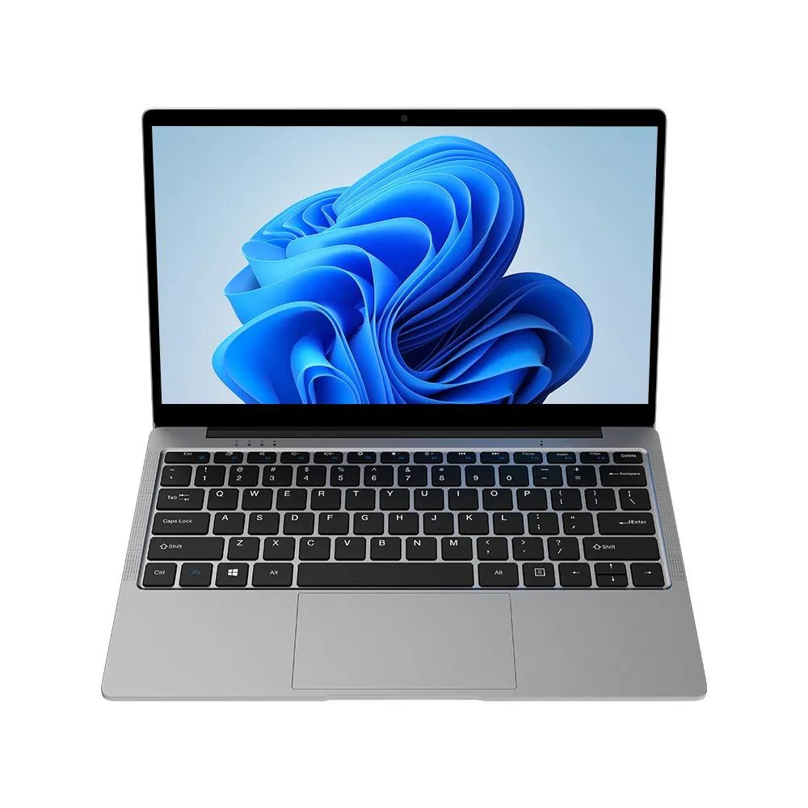
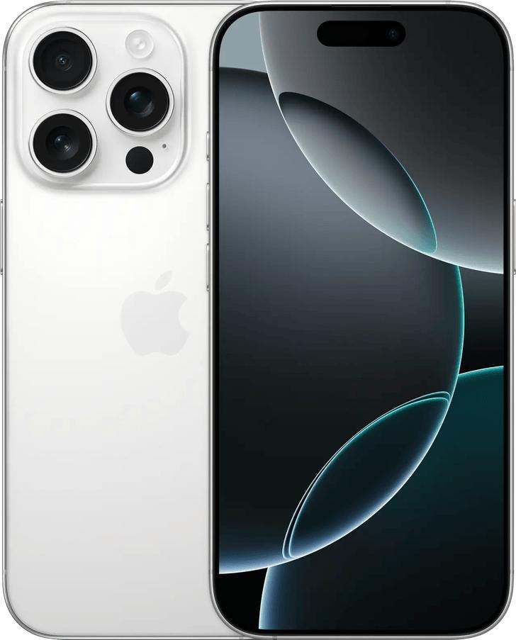
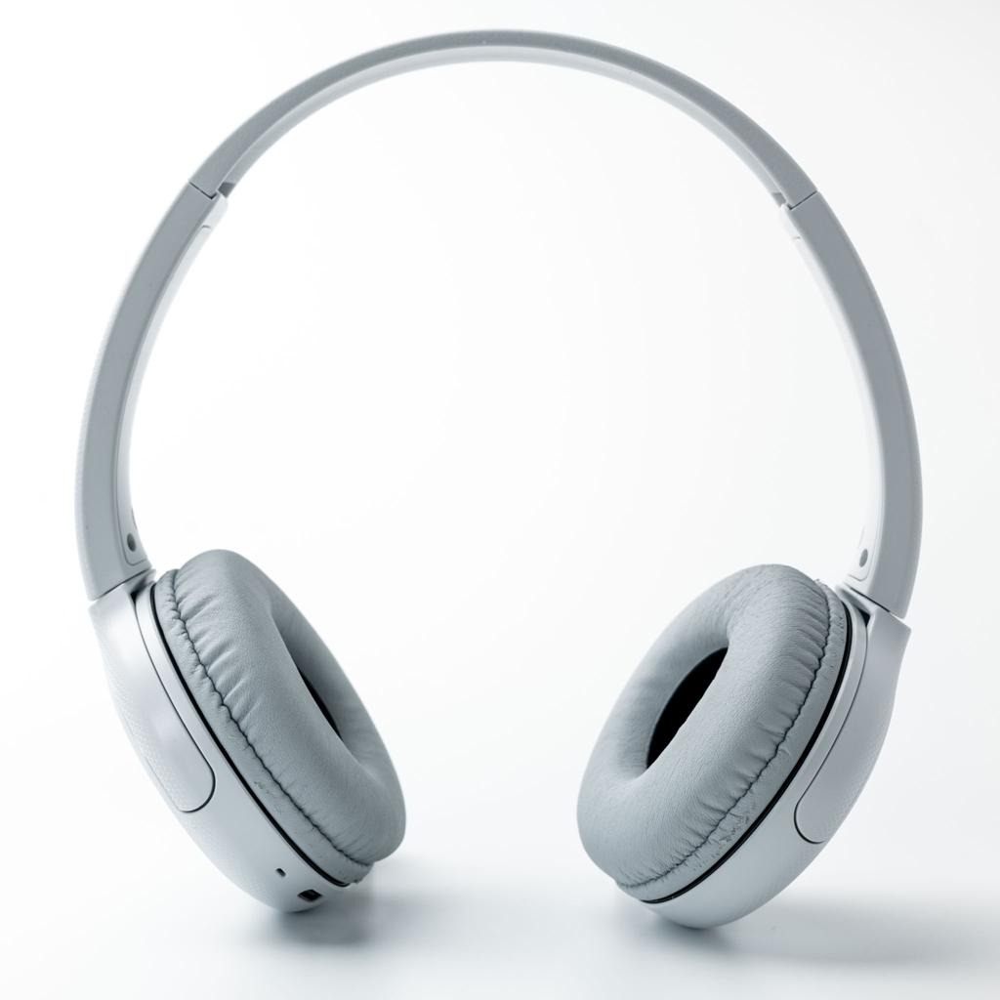
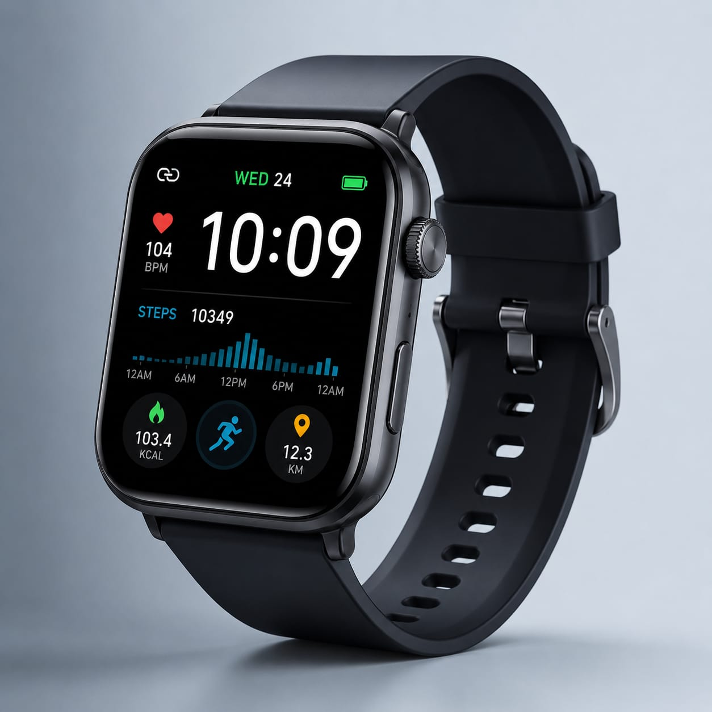

# Ex02 Commercial Website
## Date:27/072026
## AIM
To create a commercial website using CSS Flexbox.

## ALGORITHM
### STEP 1
Create an HTML file (index.html)

### STEP 2
Create a CSS file (style.css)

### STEP 3
Include a navigation bar with links to different sections.

### STEP 4
Add structured sections for Homepage, Products / Services, About Us, Contact Details and User Account.

### STEP 5
Include social media links at the footer with copyright information.

### STEP 6
Define global styles for fonts, colors, and layout.

### STEP 7
Style the header, navigation bar, and sections.

### STEP 8
Use Flexbox for layout design.

### STEP 9
Add hover effects and transitions for interactivity.

### STEP 10
Add Images and Media.

### STEP 11
Use optimized images for a professional look.

### STEP 12
Open the HTML file in a browser to check layout and functionality.

### STEP 13
Fix styling issues and refine content placement.

### STEP 14
Deploy the website.

### STEP 15
Upload to GitHub Pages for free hosting.

## PROGRAM
```
<!DOCTYPE html>
<html lang="en">
<head>
<meta charset="UTF-8">
<meta name="viewport" content="width=device-width, initial-scale=1.0">
<title>Electronic Shop</title>
<link rel="stylesheet" href="style.css">
</head>

<body>

<header>
    <h2>Electronic Shop</h2>

    <nav>
        <a href="#home">Home</a>
        <a href="#products">Products</a>
        <a href="#contact">Contact</a>
    </nav>
</header>

<section class="banner" id="home">
    <h1>Welcome to Electronic Shop</h1>
    <p>Latest Electronics at Best Prices</p>
</section>

<section id="products">

<h2 class="title">Our Products</h2>

<div class="products">

<div class="card">

<h3>HP Pavilion Laptop</h3>
<p>Intel Core i5 | 8GB RAM | 512GB SSD</p>
<h4>₹55,999</h4>
<button>Buy Now</button>
</div>

<div class="card">

<h3>Apple iPhone 16 Pro</h3>
<p>256GB Storage | A18 Pro Chip | 48MP Camera</p>
<h4>₹1,19,999</h4>
<button>Buy Now</button>
</div>

<div class="card">

<h3>Sony WH-1000XM5</h3>
<p>Noise Cancelling | Bluetooth 5.3</p>
<h4>₹29,999</h4>
<button>Buy Now</button>
</div>

<div class="card">

<h3>Apple Watch Series 10</h3>
<p>GPS | Heart Rate Monitor</p>
<h4>₹49,999</h4>
<button>Buy Now</button>
</div>

</div>

</section>

<section id="contact">

<h2>Contact Us</h2>

<p>Email : electronicshop@gmail.com</p>

<p>Phone : +91 9876543210</p>

<p>Address : chennai,Hyderabad, Telangana</p>

</section>

<footer>

<p>© 2026 Electronic Shop | All Rights Reserved</p>

</footer>

</body>
</html>
```
```
*{
margin:0;
padding:0;
box-sizing:border-box;
font-family:Arial,sans-serif;
}

body{
background:#f5f5f5;
}

/* Header */

header{
background:#0d47a1;
display:flex;
justify-content:space-between;
align-items:center;
padding:15px 60px;
position:sticky;
top:0;
}

header h2{
color:white;
}

nav a{
text-decoration:none;
color:white;
margin-left:20px;
font-weight:bold;
transition:0.3s;
}

nav a:hover{
color:yellow;
}

/* Banner */

.banner{
height:350px;
background:linear-gradient(to right,#1976d2,#42a5f5);
display:flex;
flex-direction:column;
justify-content:center;
align-items:center;
color:white;
text-align:center;
}

.banner h1{
font-size:45px;
}

.banner p{
font-size:22px;
margin-top:10px;
}

/* Products */

.title{
text-align:center;
margin:40px;
font-size:35px;
}

.products{
display:grid;
grid-template-columns:repeat(auto-fit,minmax(260px,1fr));
gap:25px;
padding:20px 50px;
}

.card{
background:white;
border-radius:12px;
padding:20px;
text-align:center;
box-shadow:0 5px 15px rgba(0,0,0,0.2);
transition:0.3s;
}

.card:hover{
transform:translateY(-8px);
}

.card img{
width:220px;
height:180px;
object-fit:contain;
display:block;
margin:auto;
}

.card h3{
margin-top:15px;
font-size:24px;
}

.card p{
margin:10px 0;
font-size:17px;
}

.card h4{
color:#0d47a1;
font-size:24px;
margin-bottom:15px;
}

button{
padding:12px 25px;
background:#0d47a1;
color:white;
border:none;
border-radius:5px;
cursor:pointer;
font-size:16px;
}

button:hover{
background:green;
}

/* Contact */

#contact{
background:white;
margin-top:40px;
padding:40px;
text-align:center;
}

#contact h2{
margin-bottom:20px;
}

#contact p{
font-size:18px;
margin:10px;
}

/* Footer */

footer{
background:#0d47a1;
color:white;
text-align:center;
padding:18px;
margin-top:20px;
}
```
## OUTPUT


## RESULT
The program for creating commercial website using CSS Flexbox is executed successfully.
